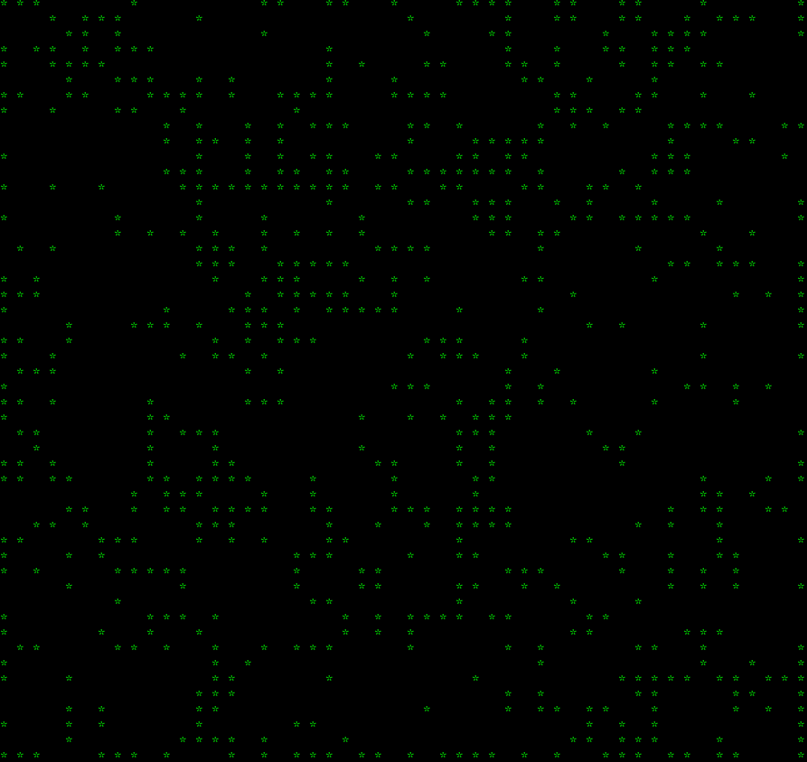

# 12 03 2024

## adventure 03: polish up a basic implementation of conway's game of life

- at recurse center, there's a pairing workshop run by faculty during the first week of batch. recursers can get a first taste of, or a refresher on, pair programming
- rc's pair programming definition is pretty un-opinionated: "working on code in real-time with another person, or multiple people"
- we were told we would practice pairing by implementing [conway's game of life](https://conwaylife.com/wiki/Conway%27s_Game_of_Life) - according to its dedicated wiki, it is "the best-known example of a cellular automaton"

    
    _game of life rules, as explained by rc faculty_

- my pairing partner and i booted up a [replit](https://replit.com/) and got a basic python implementation working in the workshop time + with some extra time right after the session (because we wanted to get it working!!). the game was hardcoded to a 3x3 grid, with 1s and 0s representing alive and dead cells, and 5 'generations' of life. each generation printed its grid to console below the previous generation's grid. so it was functional but not pretty. we also learned that the game gets to a 'stable' state really fast on a 3x3 grid.

    

    _this game was stable by generation 2 - a common snoozefest on a grid this size_

- today, i decided to add some graphical polish 💅🏾 to this implementation, as well as generalize the grid size (the one below is 50x50) and allow for infinite generations

    

- [code here](https://github.com/iconix/rc-conway/tree/ec150fff3b765f216412f2d1a72d3ac9ca5e6d2a)
