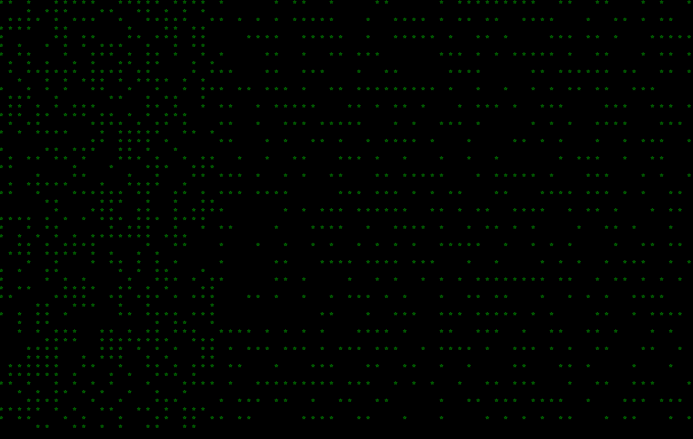

# 12 04 2024

## adventure 04: add aging cells to conway's game of life

- today picks up from [adventure 03](../03/README.md) to add more colors to cells as they survive/age in the game of life
- i chose something simpler and with less context-switching because i didn't have a lot of time to program today. our hvac system decided to stop heating our house, and it is literally freezing out! 🥶 really feeling like an adult today
- anyway, the color progression is green (1st gen) → yellow (2nd gen) → blue (3rd gen) → red (4th+ gen)
- i like it - so pretty 😍 also reminds me of christmas lights: 'tis the season!

    

- also did some general cleanup, like allowing the user to change the time delay between generation renders
- [code here](https://github.com/iconix/rc-conway/tree/85782a87872f394812d04d4cfa7a1f7235b5f7ed)
