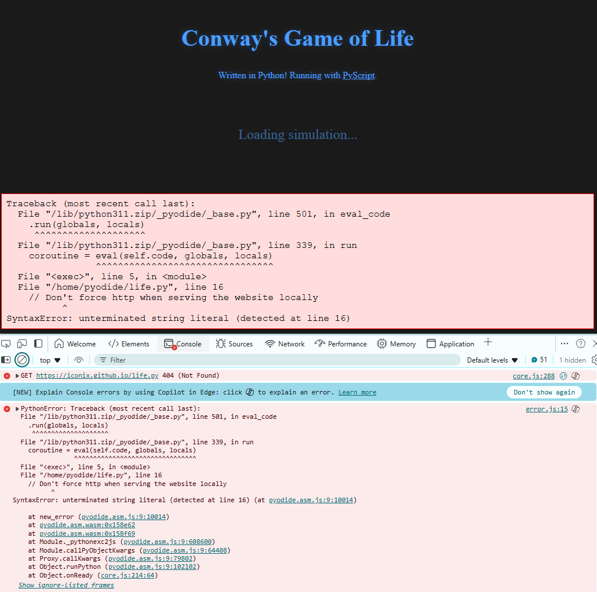

# 12 05 2024

## adventure 05: run python in browser for conway's game of life

- today picks up from [adventure 04](../04/README.md). i googled whether there's a way to run python in the browser - had a feeling that i'd read that this is possible somewhere, probably on hacker news. and there is: [pyscript](https://pyscript.net/), an "open source platform for python in the browser" 🐍
- basically, i don't want to port this implementation to javascript, but i still want to be able to point folks to it running on the internet 💁🏾‍♀️
- as someone on hn put it, pyscript's elevator pitch would be "python inside script tags via pyodide" - [pyodide](https://github.com/pyodide/pyodide) is providing the core magic, as its a port of regular ol' cpython, compiled to webassembly/emscripten so that we can run pure python in web browsers (or even node.js) - pretty neat!!
- pyscript is from the makers of anaconda, numpy, scipy, etc. the anaconda ceo and cofounder peter wang gave a [keynote at pycon 2022](https://www.youtube.com/watch?v=qKfkCY7cmBQ) introducing it

    
    _from peter wang's pycon 2022 keynote: "programming for everyone (or, the next 100 million pythonistas)"_

- sidenote: i tried switching to [micropython](https://micropython.org/) instead of pyodide, which pyscript also supports. but micropython doesn't include `asyncio`, `argparse`, `dataclasses`, or `typing`. once i googled micropython, its lack of support for these things made more sense, as its an implementation of python3 optimized for microcontrollers and embedded systems. i could do without everything but `asyncio` - well, i could even do without `asyncio`, but then i'd need to use something like `requestAnimationFrame` from javascript to handle the game loop. was hoping for a speedup on page load, but it's fine
- sadly, [github pages hosting](https://iconix.github.io/rc-conway/life.html) isn't working for 'reasons' ... was hoping to iframe it actually running here in this readme!

    
    _the 'reasons'_

- anyway, here's a gif from running in a browser on localhost! requires a local web server (because the python code is in a separate file)

    

- [code here](https://github.com/iconix/rc-conway/tree/77ff3c41e57548976853f7ef8151b553cde4bbec)
