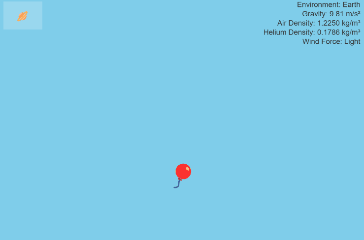

# 12 09 2024

## adventure 09: simulate helium balloon physics

- unfortunately, my weekend was a little too busy with life things (infant care + household chores + preparing to host christmas in a house that we haven't fully moved into yet!) to find enough time to code. hoping to make it happen next weekend! but we shall see...
- we shall also see how my adventures unfold once recurse goes on winter break next week. with recurse, i have a legitimate excuse to lock myself away from family and code...
- anyway! for today, i finished a nature of code sketch that i _just barely_ was able to begin late saturday night
- this is my first completed exercise from chapter 2
- this adventure was interesting because i went deeper on making force a 'realistic' vector than the book has (so far). for example, while the book may arbitrarily use `createVector(0, 0.1)` to represent gravitational force, i use `createVector(0, this.mass * 9.81)`, on earth.
- i also dug a bit into what force causes a helium balloon to rise... buoyancy was expressed by Archimedes as "any object, totally or partially immersed in a fluid or liquid, is buoyed up by a force equal to the weight of the fluid displaced by the object" ([via](https://www.mcgill.ca/oss/article/general-science/soaring-helium)) -- or `F = ρ * V * g` (density of the fluid/air * object/displaced fluid volume * acceleration due to gravity)
- i made up a psuedo-volume for my pixel balloon based on font size lol 🎈
- then to keep things interesting, i started exploring other non-earth atmospheres...
- [code here](https://github.com/iconix/rc-natureofcode/tree/9af3175820964ca1f4bc632dad6169d65033b3e1/exercise_21)
- [play here](https://htmlpreview.github.io/?https://github.com/iconix/rc-natureofcode/blob/main/exercise_21/index.html)

