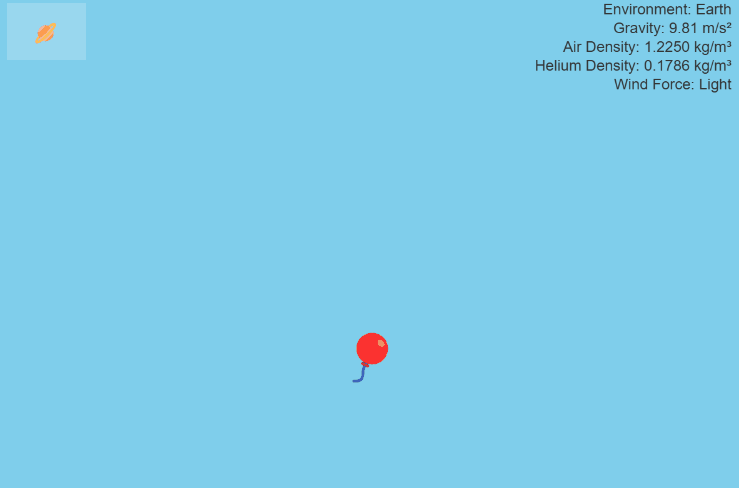

# 12 09 2024

## adventure 09: simulate helium balloon physics

- unfortunately, my weekend was a little too busy with life things (infant care + household chores + preparing to host christmas in a house that we haven't fully moved into yet!) to find enough time to code. hoping to make it happen next weekend! but we shall see...
- we shall also see how my adventures unfold once recurse goes on winter break next week. with recurse, i have a legitimate excuse to lock myself away from family and code...
- anyway! for today, i finished a nature of code sketch that i _just barely_ was able to begin late saturday night
- this is my first completed exercise from chapter 2
- [code here](https://github.com/iconix/rc-natureofcode/tree/9af3175820964ca1f4bc632dad6169d65033b3e1/exercise_21)
- [play here](https://htmlpreview.github.io/?https://github.com/iconix/rc-natureofcode/blob/main/exercise_21/index.html)

